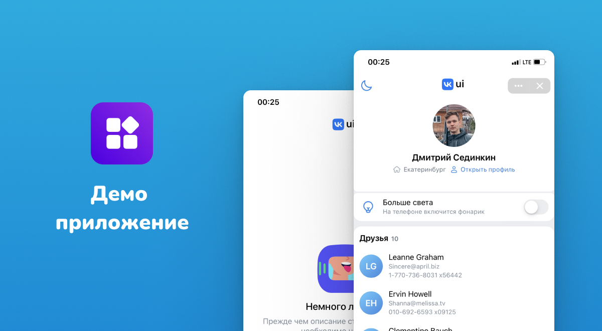

# FRONTEND

## Стек

- [React](https://reactjs.org/)
- [TypeScript](https://www.typescriptlang.org/)
- [elum-state](https://www.npmjs.com/package/elum-state)
- [VK Bridge](https://dev.vk.com/mini-apps/bridge)
- [VK Mini Apps Deploy](https://github.com/VKCOM/vk-miniapps-deploy)
- [VK Mini Apps Router](https://github.com/VKCOM/vk-mini-app-router)
- [VKUI](https://dev.vk.com/libraries/vkui)

## Запуск

```bash
# Установка зависимостей
yarn

# Запуск
yarn start

# Сборка
yarn build

# Размещение приложения на хостинге VK Mini Apps
yarn deploy
```

Чтобы посмотреть приложение без локальной инициализации, oткройте https://vk.com/app51504769.
